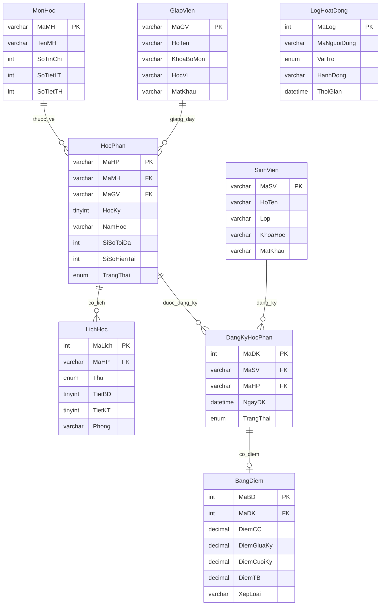
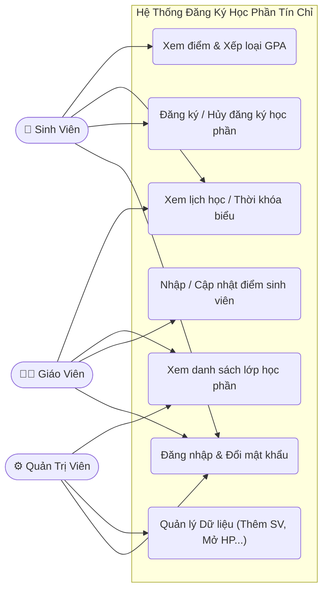
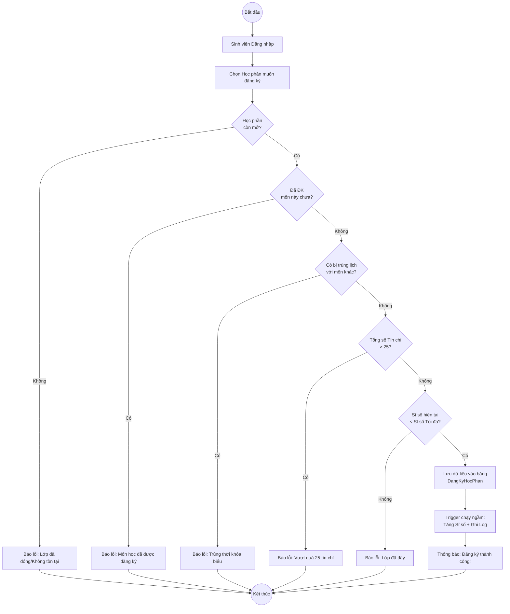

# 📚 QUẢN LÝ SINH VIÊN ĐĂNG KÝ HỌC PHẦN TÍN CHỈ
**Môn:** Hệ Quản Trị Cơ Sở Dữ Liệu | **Trường:** UTH | **CSDL:** MySQL 8.0+

---

## 👥 Thành Viên Nhóm
| STT | Họ và Tên | MSSV | Phân Công |
|-----|-----------|------|-----------|
| 1 | | | Thiết kế CSDL + File 01, 02 |
| 2 | | | Functions (File 03) |
| 3 | | | Stored Procedures (File 04) |
| 4 | | | Triggers + Views (File 05, 06) |
| 5 | | | Transactions + Báo cáo (File 07) |

---

## 🗂️ Cấu Trúc File
```
sql/
├── 01_CreateDatabase.sql     ← 8 bảng + ràng buộc
├── 02_SampleData.sql         ← 15 SV, 5 GV, 10 môn, 12 HP
├── 03_Functions.sql          ← 6 Functions
├── 04_StoredProcedures.sql   ← 10 Stored Procedures
├── 05_Triggers.sql           ← 6 Triggers
├── 06_Views.sql              ← 5 Views
└── 07_Transactions_Demo.sql  ← Demo 5 lỗi Transaction
```

---

## 🗄️ Sơ Đồ ERD



---

## 📊 Sơ Đồ Quan Hệ Bảng

```
┌───────────┐    ┌──────────────────┐    ┌──────────┐
│ GiaoVien  │───►│    HocPhan       │◄───│  MonHoc  │
│ MaGV (PK) │    │ MaHP (PK)        │    │ MaMH(PK) │
│ HoTen     │    │ MaMH,MaGV (FK)   │    │ TenMH    │
│ MatKhau   │    │ SiSo, TrangThai  │    │ SoTinChi │
└───────────┘    └────────┬─────────┘    └──────────┘
                          │ 1:N
               ┌──────────┴──────────┐
               ▼                     ▼
    ┌─────────────┐       ┌──────────────────┐
    │  LichHoc    │       │  DangKyHocPhan   │──────┐
    │ MaLich (PK) │       │  MaDK (PK)       │      │
    │ MaHP (FK)   │       │  MaSV, MaHP (FK) │      ▼
    │ Thu,Tiet    │       │  TrangThai        │  ┌──────────┐
    │ Phong       │       └────────┬──────────┘  │ BangDiem │
    └─────────────┘                │             │ DiemTB   │
                        ┌──────────┘             │ XepLoai  │
                        ▼                        └──────────┘
               ┌──────────────┐
               │  SinhVien    │
               │ MaSV (PK)    │
               │ HoTen, Lop   │
               │ MatKhau      │
               └──────────────┘
```

---

## ⚙️ Thành Phần Đã Cài Đặt

### Functions (6)
| Hàm | Chức năng |
|-----|-----------|
| `f_HashPassword(pwd)` | Mã hóa mật khẩu SHA2-256 |
| `f_TinhDiemTB(cc,gk,ck)` | Tính điểm TB = CC×10%+GK×30%+CK×60% |
| `f_TinhGPA(maSV)` | Tính GPA thang 4.0 |
| `f_XepLoaiHocLuc(gpa)` | Xếp loại học lực theo GPA |
| `f_KiemTraTrungLich(maSV,maHP)` | Kiểm tra trùng lịch (1=trùng) |
| `f_TongTinChiDaDangKy(maSV,hk,nh)` | Tổng tín chỉ đã ĐK trong HK |

### Stored Procedures (10)
| Thủ tục | Chức năng |
|---------|-----------|
| `sp_DangNhap` | Đăng nhập SV / GV |
| `sp_DangKyHocPhan` | Đăng ký HP (kiểm tra đầy đủ) |
| `sp_HuyDangKyHocPhan` | Hủy đăng ký HP |
| `sp_XemDanhSachHocPhan` | Xem HP đang mở ĐK |
| `sp_XemLichHocSinhVien` | Xem TKB của SV |
| `sp_XemBangDiem` | Xem điểm + GPA |
| `sp_CapNhatDiem` | GV nhập/sửa điểm |
| `sp_ThemSinhVien` | Admin thêm SV mới |
| `sp_ThongKeSinhVienTheoHP` | DS SV trong HP |
| `sp_DoiMatKhau` | Đổi mật khẩu |

### Triggers (6)
| Trigger | Sự kiện | Chức năng |
|---------|---------|-----------|
| `trg_BEFORE_DangKy_KiemTra` | BEFORE INSERT DangKy | Kiểm tra trùng lịch, đầy lớp |
| `trg_AFTER_DangKy_CapNhatSiSo` | AFTER INSERT DangKy | Tự tăng SiSo + Log |
| `trg_AFTER_HuyDangKy_CapNhatSiSo` | AFTER UPDATE DangKy | Tự giảm SiSo + Log |
| `trg_BEFORE_XoaHocPhan_BaoVe` | BEFORE DELETE HocPhan | Ngăn xóa HP có SV |
| `trg_AFTER_InsertDiem_GhiLog` | AFTER INSERT BangDiem | Log nhập điểm |
| `trg_BEFORE_XoaSinhVien_BaoVe` | BEFORE DELETE SinhVien | Ngăn xóa SV đang ĐK |

### Views (5)
| View | Chức năng |
|------|-----------|
| `vw_BangDiemTongHop` | Bảng điểm đầy đủ tất cả SV |
| `vw_LichHocTongHop` | Thời khóa biểu tổng hợp |
| `vw_ThongKeHocPhan` | Thống kê sĩ số, điểm TB lớp |
| `vw_XepHangSinhVien` | Xếp hạng GPA toàn trường |
| `vw_LogHoatDongChiTiet` | Nhật ký hoạt động chi tiết |

---

## ⚠️ Demo 5 Lỗi Transaction

| # | Lỗi | Mô tả | Cách Fix |
|---|-----|-------|----------|
| 1 | **Lost Update** | 2 transaction ghi đè lên nhau | `UPDATE x = x + 1` (nguyên tử) |
| 2 | **Dirty Read** | Đọc dữ liệu chưa COMMIT | `SET ISOLATION LEVEL READ COMMITTED` |
| 3 | **Non-repeatable Read** | Đọc 2 lần ra 2 kết quả khác | `SET ISOLATION LEVEL REPEATABLE READ` |
| 4 | **Phantom Read** | Số dòng thay đổi giữa 2 lần đọc | `SET ISOLATION LEVEL SERIALIZABLE` |
| 5 | **Deadlock** | 2 transaction chờ nhau → bế tắc | Khóa theo thứ tự cố định |

**Bảng mức cô lập:**

| Mức cô lập | Dirty Read | Non-repeat | Phantom |
|------------|:----------:|:----------:|:-------:|
| READ UNCOMMITTED | CÓ | CÓ | CÓ |
| READ COMMITTED | ✅ Ngăn | CÓ | CÓ |
| REPEATABLE READ *(mặc định)* | ✅ Ngăn | ✅ Ngăn | CÓ |
| SERIALIZABLE | ✅ Ngăn | ✅ Ngăn | ✅ Ngăn |

---

## 🚀 Hướng Dẫn Chạy

### Bước 1: Cài đặt
- MySQL Server 8.0+ + MySQL Workbench

### Bước 2: Chạy lần lượt từng file
> **File → Open SQL Script → Execute (Ctrl+Shift+Enter)**

```
01_CreateDatabase.sql   → Tạo DB + 8 bảng
02_SampleData.sql       → Insert dữ liệu mẫu
03_Functions.sql        → Tạo 6 Functions
04_StoredProcedures.sql → Tạo 10 Stored Procedures
05_Triggers.sql         → Tạo 6 Triggers
06_Views.sql            → Tạo 5 Views
07_Transactions_Demo.sql → Demo 5 lỗi
```

### Bước 3: Test nhanh
```sql
USE QuanLyDKHP;

-- Đăng nhập
CALL sp_DangNhap('SV001','sv123456','SinhVien',@ok,@ten,@msg);
SELECT @ok, @ten, @msg;

-- Đăng ký học phần
CALL sp_DangKyHocPhan('SV015','HP002',@ok,@msg);
SELECT @ok, @msg;

-- Xem bảng điểm
CALL sp_XemBangDiem('SV001');

-- Xem lịch học
CALL sp_XemLichHocSinhVien('SV001',1,'2025-2026');

-- Xếp hạng GPA
SELECT * FROM vw_XepHangSinhVien ORDER BY GPA_Thang4 DESC;
```

---

## 🔐 Tài Khoản Mặc Định

| Loại | Mã | Mật khẩu |
|------|----|----------|
| Sinh viên | SV001 – SV015 | `sv123456` |
| Giáo viên | GV001 – GV005 | `gv123456` |

> Mật khẩu mã hóa **SHA2-256** trước khi lưu DB.

---

## 📐 Ràng Buộc Quan Trọng

| Ràng buộc | Mô tả |
|-----------|-------|
| `SoTinChi` ∈ [1,10] | Số tín chỉ hợp lệ |
| `SiSoHienTai` ≤ `SiSoToiDa` | Không vượt sĩ số tối đa |
| Điểm ∈ [0,10] | Tất cả điểm thành phần |
| `DiemTB` tự tính (Generated Column) | CC×10%+GK×30%+CK×60% |
| (MaSV, MaHP) UNIQUE | Mỗi SV chỉ ĐK 1 lần/HP |
| Max 25 tín chỉ/học kỳ | Kiểm tra trong SP |
| Trùng lịch bị từ chối | Kiểm tra qua Function |

---

## 🔄 Luồng Nghiệp Vụ Chính

```
SV Đăng nhập (sp_DangNhap)
    ↓
Xem HP mở ĐK (sp_XemDanhSachHocPhan)
    ↓
Đăng ký HP (sp_DangKyHocPhan)
    ├─ Kiểm tra: còn mở? còn chỗ? chưa ĐK? không trùng lịch? ≤25TC?
    └─ OK → INSERT → Trigger tự cập nhật SiSo + ghi Log
    ↓
Xem lịch học (vw_LichHocTongHop)
    ↓
Cuối kỳ: GV nhập điểm (sp_CapNhatDiem)
    └─ Trigger ghi log thay đổi điểm
    ↓
SV xem điểm + GPA (sp_XemBangDiem)
    └─ f_TinhGPA → f_XepLoaiHocLuc
```

---

**Engine:** InnoDB | **Charset:** utf8mb4 | **Mã hóa:** SHA2-256 | **Isolation mặc định:** REPEATABLE READ

---

## 🧩 PHỤ LỤC BỔ SUNG (Dành cho Báo Cáo)

### 1. Bảng Tổng Kết Đánh Giá Thành Viên

| STT | Họ và Tên | MSSV | Phân Công Nhiệm Vụ | Mức độ hoàn thành (%) | Chữ ký xác nhận |
|:---:|:---|:---|:---|:---:|:---:|
| 1 | Nguyễn Văn A | 22511xxx | Thiết kế CSDL, Code tạo bảng & dữ liệu mẫu | 100% | |
| 2 | Trần Thị B | 22511xxx | Phân tích nghiệp vụ, Viết Functions xử lý | 100% | |
| 3 | Lê Văn C | 22511xxx | Viết Stored Procedures cốt lõi | 100% | |
| 4 | Phạm Thị D | 22511xxx | Xây dựng Triggers tự động & Views thống kê | 100% | |
| 5 | Hoàng Văn E | 22511xxx | Xử lý Transactions, Test lỗi và Viết Báo cáo | 100% | |

### 2. Sơ Đồ Chức Năng (Use Case Diagram)



### 3. Lưu Đồ Hoạt Động (Activity Diagram) - Luồng Đăng ký môn



### 4. Từ Điển Dữ Liệu (Data Dictionary)

**Bảng: SinhVien**
| Tên cột | Kiểu dữ liệu | Khóa | Ràng buộc | Ý nghĩa |
|---|---|:---:|---|---|
| MaSV | VARCHAR(20) | **PK** | NOT NULL | Mã số sinh viên |
| HoTen | VARCHAR(100)| | NOT NULL | Họ và tên |
| Lop | VARCHAR(50) | | | Lớp sinh hoạt |
| KhoaHoc | VARCHAR(20) | | | Khóa nhập học |
| MatKhau | VARCHAR(255)| | NOT NULL | Mật khẩu (SHA2-256) |

**Bảng: HocPhan**
| Tên cột | Kiểu dữ liệu | Khóa | Ràng buộc | Ý nghĩa |
|---|---|:---:|---|---|
| MaHP | VARCHAR(20) | **PK** | NOT NULL | Mã học phần |
| MaMH | VARCHAR(20) | **FK** | NOT NULL | Mã môn học |
| MaGV | VARCHAR(20) | **FK** | NOT NULL | Mã giảng viên |
| HocKy | TINYINT | | CHECK(1-3) | Học kỳ |
| NamHoc | VARCHAR(20) | | NOT NULL | Năm học |
| SiSoToiDa | INT | | DEFAULT 40 | Sĩ số tối đa |
| SiSoHienTai| INT | | DEFAULT 0 | Sĩ số hiện tại |
| TrangThai | ENUM | | 'Mo', 'Dong', 'Huy' | Trạng thái đăng ký |

**Bảng: DangKyHocPhan**
| Tên cột | Kiểu dữ liệu | Khóa | Ràng buộc | Ý nghĩa |
|---|---|:---:|---|---|
| MaDK | INT | **PK** | AUTO_INCREMENT | Mã lượt đăng ký |
| MaSV | VARCHAR(20) | **FK** | NOT NULL | Mã sinh viên |
| MaHP | VARCHAR(20) | **FK** | NOT NULL | Mã học phần |
| NgayDK | DATETIME | | DEFAULT NOW() | Thời gian |
| TrangThai| ENUM | | 'DangKy', 'Huy' | Trạng thái |
*(Có ràng buộc UNIQUE(MaSV, MaHP))*
