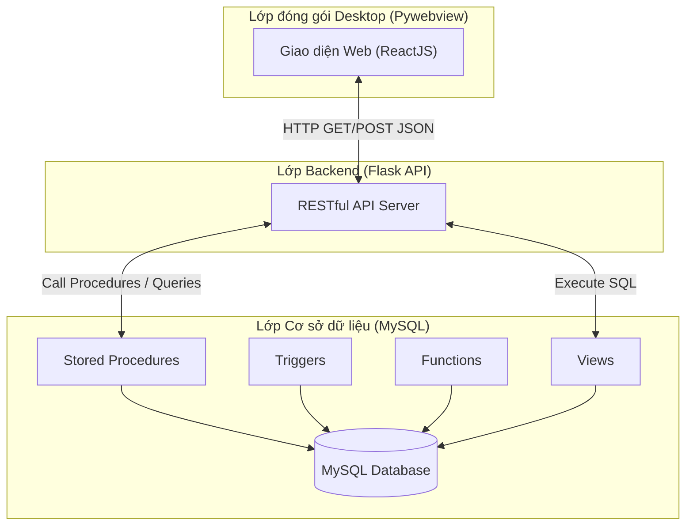
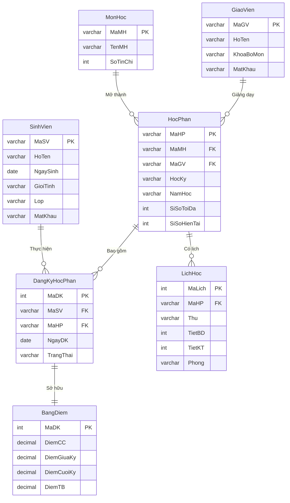

# HỆ THỐNG QUẢN LÝ ĐĂNG KÝ HỌC PHẦN (UTH PORTAL)

**Môn học:** Hệ Quản trị Cơ sở dữ liệu  
**Trường:** Đại học Giao thông Vận tải TP.HCM (UTH)  
**Đề tài số 6:** Quản lý sinh viên đăng ký học phần tín chỉ  

---

## 1. MÔ TẢ TỔNG QUAN

Hệ thống quản lý đăng ký học phần trực tuyến được xây dựng nhằm mô phỏng quy trình đăng ký tín chỉ thực tế của sinh viên UTH. Dự án tập trung sâu vào việc thiết kế và tối ưu hóa cơ sở dữ liệu quan hệ (MySQL), khai thác tối đa sức mạnh của hệ quản trị CSDL thông qua việc triển khai đồng bộ các đối tượng như Tables, Views, Functions, Stored Procedures và Triggers.

Bên cạnh đó, dự án được tích hợp một giao diện người dùng hiện đại (Frontend) và API xử lý dữ liệu (Backend) độc lập, sau đó được đóng gói thành một phần mềm Desktop duy nhất, mang lại trải nghiệm người dùng tối ưu và thuận tiện cho việc triển khai cũng như đánh giá.

---

## 2. KIẾN TRÚC VÀ CÔNG NGHỆ SỬ DỤNG

### Mô hình kiến trúc
Hệ thống được thiết kế theo mô hình 3 lớp (3-Tier Architecture) kết hợp với kiến trúc Client-Server, được đóng gói trong một môi trường Desktop:

1. **Lớp Giao diện (Presentation Layer - Frontend):** 
   - **Công nghệ:** ReactJS, TypeScript, TailwindCSS, Vite.
   - **Vai trò:** Hiển thị thông tin trực quan, tiếp nhận thao tác của người dùng (Sinh viên/Giảng viên).

2. **Lớp Xử lý (Application Layer - Backend):**
   - **Công nghệ:** Python, Flask (RESTful API), Flask-CORS.
   - **Vai trò:** Cầu nối giao tiếp, nhận request từ Frontend, phân giải tham số, gọi các Stored Procedures dưới Database và trả về dữ liệu theo định dạng chuẩn JSON.

3. **Lớp Dữ liệu (Data Layer - Database):**
   - **Công nghệ:** MySQL 8.0+.
   - **Vai trò:** Lưu trữ dữ liệu vật lý, đảm bảo tính toàn vẹn thông qua các Constraint và Trigger, xử lý logic nghiệp vụ lõi (Business Logic) bằng Stored Procedures và Functions.

4. **Lớp Đóng gói (Wrapper):**
   - **Công nghệ:** PyInstaller, PyWebview, Multi-threading.
   - **Vai trò:** Khởi chạy ngầm các tiến trình máy chủ (Flask & Node.js) và hiển thị giao diện web trong một cửa sổ ứng dụng Desktop độc lập (.exe).

### Sơ đồ kiến trúc hệ thống



---

## 3. CẤU TRÚC THƯ MỤC VÀ TẬP TIN DATABASE

Hệ thống cơ sở dữ liệu được thiết kế chặt chẽ và chia thành 6 tệp lệnh SQL riêng biệt để dễ dàng quản lý và triển khai. Dưới đây là mô tả chi tiết công dụng của từng tệp:

| Tên tập tin | Vai trò và Nội dung chi tiết |
|---|---|
| **01_CreateDatabase.sql** | Khởi tạo cấu trúc nền tảng. Chứa lệnh tạo Database `QuanLyDKHP` và định nghĩa cấu trúc 8 bảng thực thể (SinhVien, GiaoVien, MonHoc, HocPhan, LichHoc, DangKyHocPhan, BangDiem, LogHoatDong). Thiết lập chặt chẽ các khóa chính (Primary Key), khóa ngoại (Foreign Key) và các ràng buộc toàn vẹn (Constraints). |
| **02_SampleData.sql** | Nạp dữ liệu mẫu quy mô lớn. Lệnh tự động thêm 500 Sinh viên, 20 Giảng viên, 20 Môn học, 50 Học phần và 2.758 bản ghi đăng ký học phần kèm điểm số. Phục vụ việc kiểm thử khả năng chịu tải và tính đúng đắn của thuật toán tính điểm. |
| **03_Functions.sql** | Định nghĩa các hàm xử lý vô hướng (Scalar Functions). Nổi bật gồm: `f_TinhGPA` (Tự động tính điểm trung bình tích lũy theo trọng số tín chỉ) và `f_XepLoaiHocLuc` (Phân loại học lực Xuất sắc/Giỏi/Khá/TB dựa trên mức điểm GPA quy đổi). |
| **04_StoredProcedures.sql** | Chứa các thủ tục lưu trữ thực thi logic nghiệp vụ lõi (hơn 10 thủ tục). Đảm nhận các tác vụ phức tạp như: `sp_DangNhap` (Xác thực thông tin bằng mật khẩu băm SHA256), `sp_DangKyHocPhan` (Kiểm tra điều kiện tiên quyết, giới hạn tín chỉ), và `sp_CapNhatDiem`. |
| **05_Triggers.sql** | Chứa các bẫy sự kiện tự động (Automated Triggers). Bao gồm: `trg_DangKyHocPhan_AfterInsert` (Tự động cộng sĩ số lớp khi có đăng ký mới), `trg_DangKyHocPhan_AfterDelete` (Giảm sĩ số khi hủy học phần), và `trg_KiemTraTrungLichHoc` (Phát hiện và hủy bỏ giao dịch nếu sinh viên đăng ký môn học có lịch trùng với môn đang học). |
| **06_Views.sql** | Định nghĩa các khung nhìn (Views) phục vụ trích xuất báo cáo nhanh. Tối ưu hóa hiệu suất bằng cách cấu trúc sẵn các lệnh JOIN phức tạp. Nổi bật gồm `v_ThoiKhoaBieu_SinhVien` và `v_BangDiem_SinhVien`. |
| **demo/ (Thư mục)** | Chứa 5 kịch bản SQL độc lập nhằm giả lập các lỗi đồng thời (Concurrency Transactions) thường gặp trong hệ quản trị CSDL (Lost Update, Dirty Read, Non-Repeatable Read, Phantom Read, Deadlock) và cung cấp mã lệnh khắc phục thông qua cơ chế Lock và Transaction Isolation Levels. |

---

## 4. SƠ ĐỒ THỰC THỂ KẾT HỢP (ERD)



---

## 5. CHI TIẾT CẤU TRÚC CÁC BẢNG DỮ LIỆU

Dưới đây là chi tiết cấu trúc của 8 bảng dữ liệu trong hệ thống, bao gồm các ràng buộc (Constraints) quan trọng nhằm bảo đảm tính toàn vẹn dữ liệu:

### 5.1. Bảng `SinhVien` (Lưu thông tin sinh viên)
| Tên cột | Kiểu dữ liệu | Ràng buộc | Mô tả chi tiết |
|---------|--------------|-----------|----------------|
| `MaSV` | VARCHAR(10) | PK, NOT NULL | Mã sinh viên (Khóa chính) |
| `HoTen` | VARCHAR(100) | NOT NULL | Họ và tên sinh viên |
| `NgaySinh` | DATE | | Ngày sinh |
| `GioiTinh` | ENUM | DEFAULT 'Nam' | Giới tính ('Nam', 'Nu', 'Khac') |
| `DiaChi` | VARCHAR(200) | | Địa chỉ liên hệ |
| `Email` | VARCHAR(100) | UNIQUE | Địa chỉ email (Duy nhất) |
| `SoDT` | VARCHAR(15) | | Số điện thoại liên lạc |
| `Lop` | VARCHAR(20) | | Lớp sinh hoạt |
| `KhoaHoc` | VARCHAR(20) | | Khóa học (VD: K21) |
| `MatKhau` | VARCHAR(255) | NOT NULL | Mật khẩu (Mã hóa SHA256) |
| `NgayTao` | DATETIME | DEFAULT CURRENT_TIMESTAMP | Thời điểm tạo tài khoản |

### 5.2. Bảng `GiaoVien` (Lưu thông tin giảng viên)
| Tên cột | Kiểu dữ liệu | Ràng buộc | Mô tả chi tiết |
|---------|--------------|-----------|----------------|
| `MaGV` | VARCHAR(10) | PK, NOT NULL | Mã giảng viên (Khóa chính) |
| `HoTen` | VARCHAR(100) | NOT NULL | Họ và tên giảng viên |
| `NgaySinh` | DATE | | Ngày sinh |
| `GioiTinh` | ENUM | DEFAULT 'Nam' | Giới tính ('Nam', 'Nu', 'Khac') |
| `Email` | VARCHAR(100) | UNIQUE | Địa chỉ email (Duy nhất) |
| `SoDT` | VARCHAR(15) | | Số điện thoại |
| `KhoaBoMon` | VARCHAR(100) | | Khoa / Bộ môn công tác |
| `HocVi` | VARCHAR(50) | DEFAULT 'ThacSi' | Học vị (ThS, TS, PGS...) |
| `MatKhau` | VARCHAR(255) | NOT NULL | Mật khẩu (Mã hóa SHA256) |
| `NgayTao` | DATETIME | DEFAULT CURRENT_TIMESTAMP | Thời điểm tạo tài khoản |

### 5.3. Bảng `MonHoc` (Danh mục môn học)
| Tên cột | Kiểu dữ liệu | Ràng buộc | Mô tả chi tiết |
|---------|--------------|-----------|----------------|
| `MaMH` | VARCHAR(10) | PK, NOT NULL | Mã môn học (Khóa chính) |
| `TenMH` | VARCHAR(100) | NOT NULL | Tên môn học |
| `SoTinChi` | INT | NOT NULL, CHK(1-10) | Số tín chỉ (Chỉ từ 1 đến 10) |
| `SoTietLT` | INT | NOT NULL, DEFAULT 30 | Số tiết lý thuyết |
| `SoTietTH` | INT | NOT NULL, DEFAULT 0 | Số tiết thực hành |
| `MoTa` | TEXT | | Mô tả thông tin môn học |

### 5.4. Bảng `HocPhan` (Lớp mở theo học kỳ)
| Tên cột | Kiểu dữ liệu | Ràng buộc | Mô tả chi tiết |
|---------|--------------|-----------|----------------|
| `MaHP` | VARCHAR(10) | PK, NOT NULL | Mã học phần (Khóa chính) |
| `MaMH` | VARCHAR(10) | FK, NOT NULL | Mã môn học (Tham chiếu `MonHoc`) |
| `MaGV` | VARCHAR(10) | FK | Mã giảng viên (Tham chiếu `GiaoVien`) |
| `HocKy` | TINYINT | NOT NULL, CHK(1-3) | Học kỳ diễn ra (1, 2, 3) |
| `NamHoc` | VARCHAR(9) | NOT NULL | Năm học (VD: 2023-2024) |
| `SiSoToiDa` | INT | NOT NULL, DEFAULT 50 | Sĩ số tối đa của lớp |
| `SiSoHienTai`| INT | NOT NULL, DEFAULT 0 | Sĩ số hiện tại (Kiểm tra <= Sĩ số tối đa) |
| `NgayBatDauDK`| DATE | | Ngày bắt đầu mở đăng ký |
| `NgayKetThucDK`| DATE | | Ngày đóng đăng ký |
| `TrangThai` | ENUM | DEFAULT 'MoDangKy' | Trạng thái (MoDangKy, DongDangKy...) |

### 5.5. Bảng `LichHoc` (Thời khóa biểu của học phần)
| Tên cột | Kiểu dữ liệu | Ràng buộc | Mô tả chi tiết |
|---------|--------------|-----------|----------------|
| `MaLich` | INT | PK, AUTO_INCREMENT | Mã lịch học (Tự tăng) |
| `MaHP` | VARCHAR(10) | FK, NOT NULL | Mã học phần (Tham chiếu `HocPhan`) |
| `Thu` | ENUM | NOT NULL | Thứ trong tuần ('Thu2' -> 'ChuNhat') |
| `TietBD` | TINYINT | NOT NULL, CHK | Tiết bắt đầu (>=1 và < TietKT) |
| `TietKT` | TINYINT | NOT NULL, CHK | Tiết kết thúc (<=15) |
| `Phong` | VARCHAR(20) | NOT NULL | Mã phòng học (VD: V-A.01) |

### 5.6. Bảng `DangKyHocPhan` (Thông tin sinh viên đăng ký)
| Tên cột | Kiểu dữ liệu | Ràng buộc | Mô tả chi tiết |
|---------|--------------|-----------|----------------|
| `MaDK` | INT | PK, AUTO_INCREMENT | Mã phiếu đăng ký (Tự tăng) |
| `MaSV` | VARCHAR(10) | FK, NOT NULL, UQ | Mã sinh viên (Tham chiếu `SinhVien`) |
| `MaHP` | VARCHAR(10) | FK, NOT NULL, UQ | Mã học phần (Tham chiếu `HocPhan`) |
| `NgayDK` | DATETIME | DEFAULT CURRENT_TIMESTAMP| Ngày thực hiện thao tác đăng ký |
| `TrangThai` | ENUM | DEFAULT 'DaDuyet' | Trạng thái (DaDuyet, HuyBo, HoanThanh) |

*(Lưu ý: Cặp `MaSV` và `MaHP` là UNIQUE để tránh 1 sinh viên đăng ký 1 học phần 2 lần)*

### 5.7. Bảng `BangDiem` (Kết quả học tập theo học phần)
| Tên cột | Kiểu dữ liệu | Ràng buộc | Mô tả chi tiết |
|---------|--------------|-----------|----------------|
| `MaBD` | INT | PK, AUTO_INCREMENT | Mã bảng điểm (Tự tăng) |
| `MaDK` | INT | FK, NOT NULL, UNIQUE | Mã đăng ký (Tham chiếu `DangKyHocPhan`) |
| `DiemCC` | DECIMAL(4,2) | NOT NULL, DEFAULT 0.00 | Điểm chuyên cần (Trọng số 10%) |
| `DiemGiuaKy` | DECIMAL(4,2) | NOT NULL, DEFAULT 0.00 | Điểm giữa kỳ (Trọng số 30%) |
| `DiemCuoiKy` | DECIMAL(4,2) | NOT NULL, DEFAULT 0.00 | Điểm cuối kỳ (Trọng số 60%) |
| `DiemTB` | DECIMAL(4,2) | GENERATED STORED | Điểm tổng kết tự động tính |
| `XepLoai` | VARCHAR(2) | GENERATED STORED | Tự động xếp loại (A, B, C, D, F) |
| `NgayCapNhat`| DATETIME | ON UPDATE | Thời gian cập nhật điểm cuối cùng |
| `GhiChu` | VARCHAR(200) | | Các ghi chú bổ sung (VD: Cấm thi) |

### 5.8. Bảng `LogHoatDong` (Nhật ký kiểm toán / Audit Log)
| Tên cột | Kiểu dữ liệu | Ràng buộc | Mô tả chi tiết |
|---------|--------------|-----------|----------------|
| `MaLog` | INT | PK, AUTO_INCREMENT | ID dòng log (Tự tăng) |
| `MaNguoiDung`| VARCHAR(10) | | ID của người dùng thao tác |
| `VaiTro` | ENUM | DEFAULT 'SinhVien' | Phân quyền (SinhVien, GiaoVien, Admin) |
| `HanhDong` | VARCHAR(100) | NOT NULL | Hành động (VD: Đăng nhập, Hủy HP) |
| `BangTacDong`| VARCHAR(50) | | Tên bảng bị ảnh hưởng dữ liệu |
| `MaBanGhi` | VARCHAR(50) | | Khóa chính của dòng dữ liệu bị ảnh hưởng|
| `ThoiGian` | DATETIME | DEFAULT CURRENT_TIMESTAMP| Thời điểm xảy ra hành động |
| `GhiChu` | TEXT | | Ghi chú thêm (VD: IP hoặc nội dung lỗi)|

---

## 6. HƯỚNG DẪN CÀI ĐẶT VÀ VẬN HÀNH

### 6.1. Yêu cầu hệ thống tối thiểu
- **Hệ điều hành:** Windows 10/11 (64-bit)
- **Hệ quản trị CSDL:** MySQL Server 8.0 trở lên
- **Môi trường thực thi:** Python 3.10+ và Node.js 18+ (Dành cho việc biên dịch và khởi chạy dự án)

### 6.2. Các bước triển khai Cơ sở dữ liệu
Mở phần mềm quản trị cơ sở dữ liệu (MySQL Workbench, HeidiSQL hoặc Navicat) và thực thi lần lượt các tập tin theo đúng thứ tự quy định sau:
1. `sql/01_CreateDatabase.sql`
2. `sql/02_SampleData.sql`
3. `sql/03_Functions.sql`
4. `sql/04_StoredProcedures.sql`
5. `sql/05_Triggers.sql`
6. `sql/06_Views.sql`

*Lưu ý kỹ thuật: Tập tin `02_SampleData.sql` sử dụng chỉ thị `SET FOREIGN_KEY_CHECKS = 0;` nhằm mục đích tối ưu hóa quá trình chèn dữ liệu hàng loạt (Bulk Insert) và tạm thời bỏ qua các Trigger xác thực để nạp 2.758 bản ghi một cách nhanh chóng nhất.*

### 6.3. Cấu hình kết nối
Mở tập tin `api.py` tại thư mục gốc, điều chỉnh thông tin tại biến `DB_CONFIG` cho khớp với tài khoản quản trị MySQL cục bộ của bạn:
```python
DB_CONFIG = {
    'host': 'localhost',
    'user': 'root',
    'password': 'MAT_KHAU_CUA_BAN',
    'database': 'QuanLyDKHP'
}
```

### 6.4. Khởi chạy ứng dụng
Hệ thống được thiết lập kịch bản tự động hóa tối đa nhằm thuận tiện cho việc đánh giá:

**Phương thức 1: Khởi tạo tự động (Dành cho máy tính mới chạy lần đầu)**
Tại thư mục gốc, khởi chạy tập tin `SETUP.bat`. Script sẽ tự động chẩn đoán môi trường máy tính, tải xuống toàn bộ thư viện Python (như Flask, Pywebview) và các gói Node.js tương ứng mà không cần gõ lệnh thủ công.

**Phương thức 2: Chạy trực tiếp ứng dụng (Người dùng cuối)**
Khởi chạy tập tin `UTH_Portal_Web.exe`. Phần mềm sẽ tự động cấp phát tài nguyên luồng (threads), khởi động máy chủ API nội bộ và hiển thị giao diện phần mềm.

**Thông tin Tài khoản Thử nghiệm:**
- Phân quyền Sinh viên: Tài khoản từ `SV001` đến `SV500` (Mật khẩu mặc định: `sv123456`)
- Phân quyền Giảng viên: Tài khoản từ `GV001` đến `GV020` (Mật khẩu mặc định: `gv123456`)
